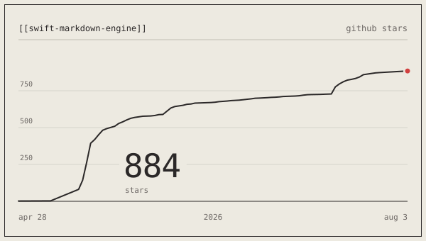

<a href="https://nodes-web.com">
  <picture>
    <source media="(prefers-color-scheme: dark)" srcset="assets/nodes-wordmark-dark.svg" />
    
  </picture>
</a>

## what we make

**Nodes** is a macOS app for writing, linking, and exploring your notes.

Your markdown and PDF files stay as plain files on your disk — you own your data, nothing locked in. Wiki-style `[[links]]` weave notes together, and a force-directed graph view lets you explore the connections between them.

It's fully on-device and private: local LLM tag suggestions, contextual search that understands meaning rather than just keywords, and no cloud dependency or data harvesting. Powerful markdown import/export means you can always take your files and leave.

Minimal, beautiful, fast. Every design decision is intentional. Every element earns its place.

→ **[nodes-web.com](https://nodes-web.com)**

---

## open source

### [swift-markdown-engine](https://github.com/nodes-app/swift-markdown-engine)

A native AppKit Markdown editor for macOS, built on TextKit 2 and bridged to SwiftUI. The same editor that powers Nodes.

<picture>
  <source media="(prefers-color-scheme: dark)" srcset="assets/star-history-dark.svg">
  
</picture>

---

## the team

<table>
  <tr>
    <td align="center" width="180">
      <a href="https://github.com/Nicolas-Py">
         
        <b>Nico</b>
      </a> 
      @Nicolas-Py 
      Munich · TUM
    </td>
    <td align="center" width="180">
      <a href="https://github.com/luca-chen198">
         
        <b>Luca</b>
      </a> 
      @luca-chen198 
      Munich · LMU
    </td>
    <td align="center" width="180">
      <a href="https://github.com/xandaaaa">
         
        <b>Xander</b>
      </a> 
      @xandaaaa 
      Zurich · ETH
    </td>
  </tr>
</table>

---

**[nodes-web.com](https://nodes-web.com)**

